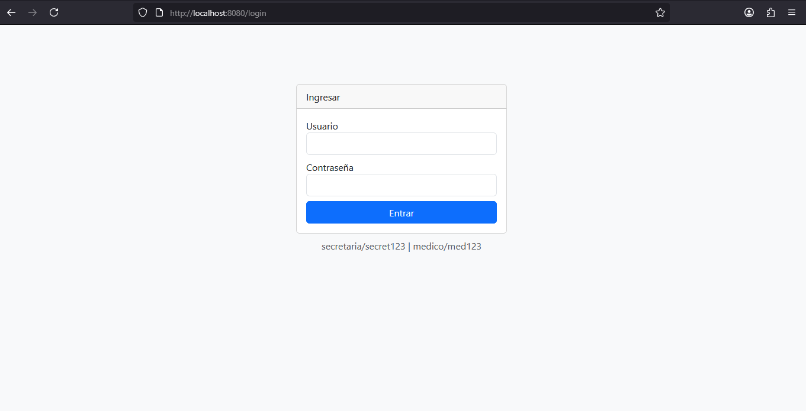

# 🏥 Sistema de Ficha Clínica

Sistema web orientado a la gestión clínica básica, que permite administrar pacientes, citas médicas y fichas clínicas, con control de acceso por roles (Secretaria y Médico).

Este proyecto fue desarrollado como parte de la evaluación final de portafolio, con el objetivo de demostrar competencias en el desarrollo de productos digitales funcionales, seguros y alineados a buenas prácticas de la industria.

---

## 🎯 Problemática que resuelve

En muchos centros de salud pequeños o consultas individuales, la gestión de pacientes y citas se realiza de forma manual o desorganizada, lo que provoca:

- Dificultad para visualizar los pacientes del día
- Errores en la asignación de horas
- Falta de centralización de la información clínica
- Acceso no controlado a datos sensibles

Este sistema resuelve esa problemática centralizando la información clínica en una plataforma web, con control de roles y acceso seguro a los datos.

---

## ✅ Funcionalidades principales

### 👩‍💼 Rol Secretaria
- Visualizar listado de pacientes
- Registrar nuevos pacientes
- Agendar citas médicas
- Visualizar citas programadas

### 👨‍⚕️ Rol Médico
- Acceso total al sistema
- Visualización de pacientes y citas
- Registro y edición de fichas clínicas
- Acceso a información médica de los pacientes

---

## 🔐 Control de acceso
- Autenticación mediante usuario y contraseña
- Roles definidos:
  - `ROLE_SECRETARIA`
  - `ROLE_MEDICO`
- El rol Médico tiene permisos completos
- El rol Secretaria tiene acceso restringido según responsabilidades

---

## 🛠 Tecnologías utilizadas

### Backend
- **Java 21**
- **Spring Boot**
- Spring MVC
- Spring Data JPA
- Spring Security

### Frontend
- **Thymeleaf**
- **Bootstrap 5**
- HTML5 / CSS3

### Base de datos
- **MySQL**
- Creación automática de tablas mediante JPA (DDL auto)

### Herramientas
- Git & GitHub (control de versiones)
- Maven
- IDE: Eclipse / IntelliJ IDEA

---

## 🧩 Enfoque de desarrollo

El proyecto fue desarrollado siguiendo principios del ciclo de vida del software:

1. **Análisis del problema**
   - Identificación de necesidades del centro clínico
   - Definición de roles y permisos

2. **Diseño**
   - Arquitectura MVC
   - Separación por capas: Controller, Service, Repository, Model
   - Modelado relacional de entidades (User, Role, Patient, Appointment)

3. **Implementación**
   - Desarrollo con Spring Boot
   - Seguridad con Spring Security
   - Vistas con Thymeleaf y Bootstrap

4. **Validación**
   - Validaciones básicas de formularios
   - Control de acceso por rol
   - Persistencia segura en base de datos

5. **Documentación y versionado**
   - Código versionado con Git
   - Documentación clara para revisión técnica

---

## 🧪 Usuarios de prueba

| Usuario     | Contraseña | Rol          |
|------------|------------|--------------|
| secretaria | secret123  | SECRETARIA   |
| medico     | med123     | MEDICO       |

---

## 📸 Capturas de pantalla

### 🔐 Login


### 🏠 Dashboard


### 👥 Gestión de Pacientes


### 👥 Gestión de Fichas


### 📅 Gestión de Citas


---

## ▶️ Ejecución del proyecto

1. Clonar el repositorio:
```bash
git clone https://github.com/frherrer/FichaMedica.git
```
2. Configurar base de datos MySQL:
```
spring.datasource.url=jdbc:mysql://localhost:3306/ficha_medica
spring.datasource.username=TU_USUARIO
spring.datasource.password=TU_PASSWORD
```
3. Ejecutar la aplicación
```bash
git clone https://github.com/frherrer/FichaMedica.git
```
4. Acceder a:
```
 http://localhost:8080
```

## 📌 Autor

Francisco Herrera
Desarrollador de software en formación
Proyecto realizado con fines académicos y de portafolio profesional.
